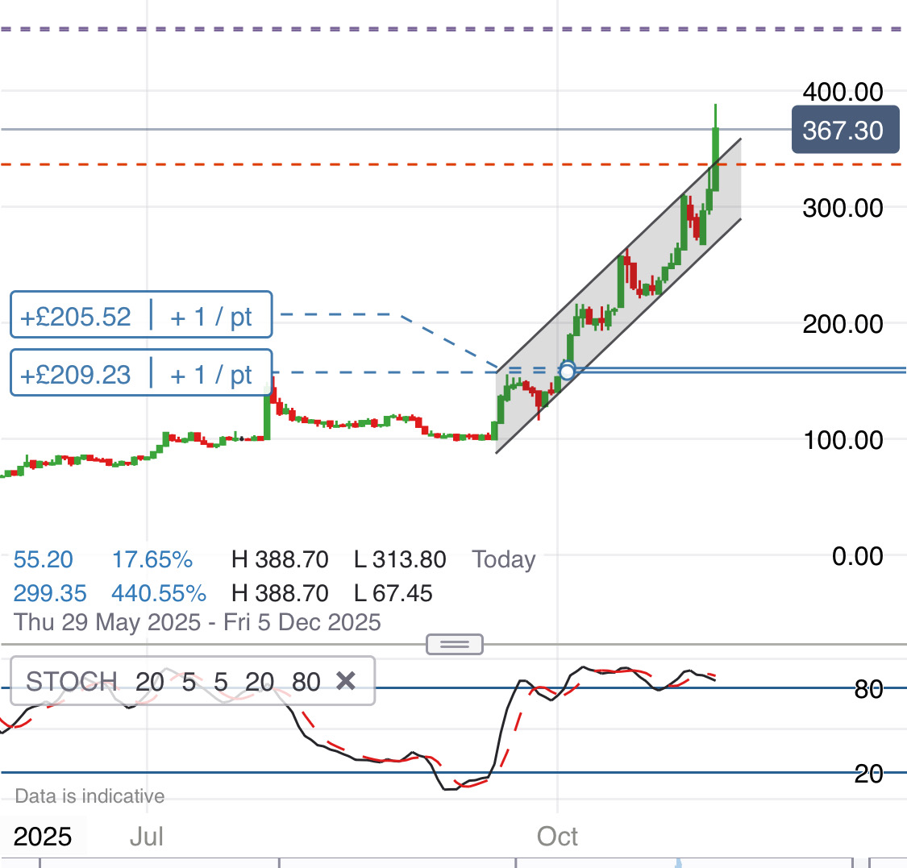

# Note -- November 5, 2025

Ceres broke out of the channel I shared yesterday. I have put a short term target at 200%. This trade is an example of why I keep working on the margin rules. I invested 60GBP and it is showing 400GBP profit, if I can get the plan nailed it will be a great earner but I am 6 Months into the project and stil don’t have it all ironed out. I have however learned a lot of things not to do.

---

*Source: [Strategic Wave Trading Notes](https://stephentobin.substack.com)*
