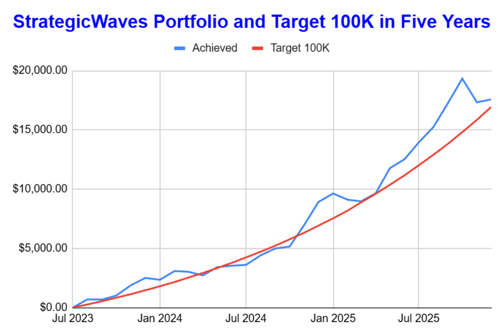

# Note -- December 2, 2025

Our small caps stocks are still being volatile, $ABAT was down 10% yesterday and is up 10% today on no news, sums up the prioce action. So far we have a single dollar in profit this month but that keeps us above target and we are approaching the half way stage of the 5 year project to turn $250 a month into $100,000. This is month 30 so only 30 more to go.

---

*Source: [Strategic Wave Trading Notes](https://stephentobin.substack.com)*
