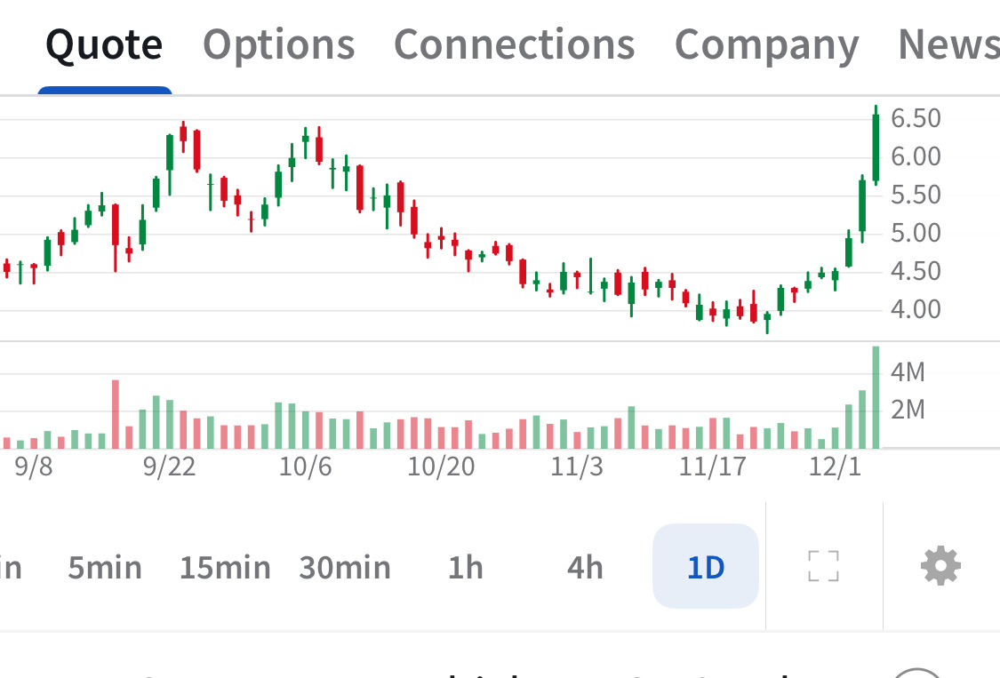

# Note -- December 5, 2025

Vertical Aerospace $EVTL closed above $6.50 previously a point of resistance. Insiders have been big buyers of late which might be driving the move. We are long at $4.84 and EVTL is one of five of our holdings up 10% this week, so far ROI in this week is over 8% starting to pullback some of last months loss

---

*Source: [Strategic Wave Trading Notes](https://stephentobin.substack.com)*
