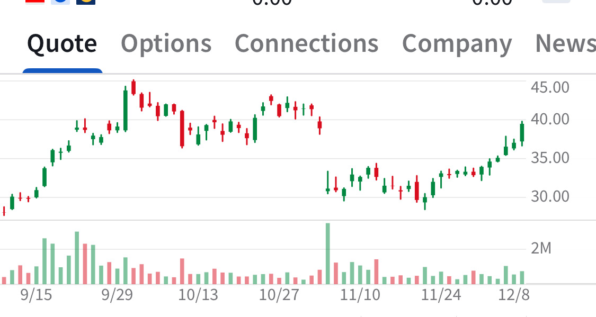

# Note -- December 11, 2025

$ACMR has closed the window following the gap down after a rather mediocre earnings report. The US expansion plans seem to be driving a new uptrend. Probably should have bought at the recent lows but already had two positions, average price $25.64. Nicely in the money targeting $55

---

*Source: [Strategic Wave Trading Notes](https://stephentobin.substack.com)*
