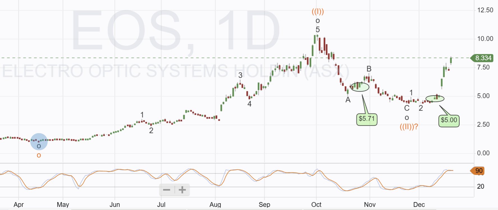

# Note -- December 19, 2025

Benefiting from a Santa Rally today with 18 out of 20 holdings in the green.  The star of the show is Electro Optic, up 17% today and 70% in the last week. My two entry positions are shown on the chart along with the pattern I am trading, the technical target is over $50, not sure I will have it that long but it has great potential. Portfolio up 7.9% in December and despite a poor November Q4 is now in profit.

---

*Source: [Strategic Wave Trading Notes](https://stephentobin.substack.com)*
