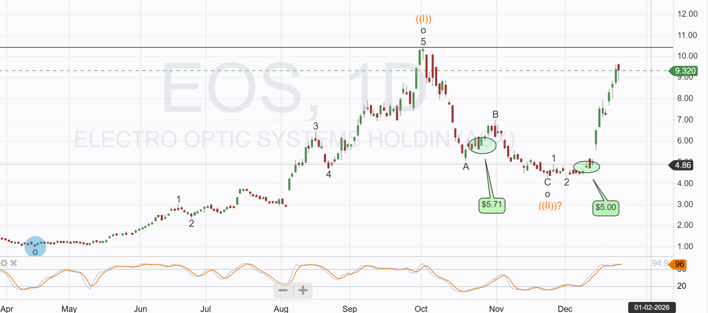

# Note -- December 24, 2025

Electro Optic is approaching the price point that marked the top of the last run up. My initial target was $11 and the second trade is now up 86% in 2 weeks approaching the target, stochastics are oversold an after such a sharpe move higher a pullback seems likely. Should I take profits or continue to hold? The fundamentals have improved with multiple orders reported in the last month including a second HELW award and orders from the US military. Possible strategies seem to be take the profit or let it ride and add to the position on any pullback. Profitable trading is all about decision making but they are not easy and careful consideration is needed

---

*Source: [Strategic Wave Trading Notes](https://stephentobin.substack.com)*
