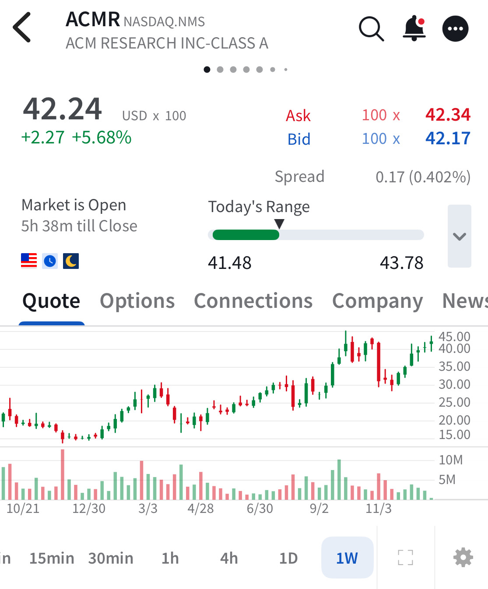

# Note -- December 30, 2025

$ACMR approaching a point of previous resistance. Tailwinds provided by recent Chinese government insistence that silicon chip making equipment is locally sourced. I am in at $25.64 average having invested twice, the initial target is as $55 which could be hit Q1 2026

---

*Source: [Strategic Wave Trading Notes](https://stephentobin.substack.com)*
