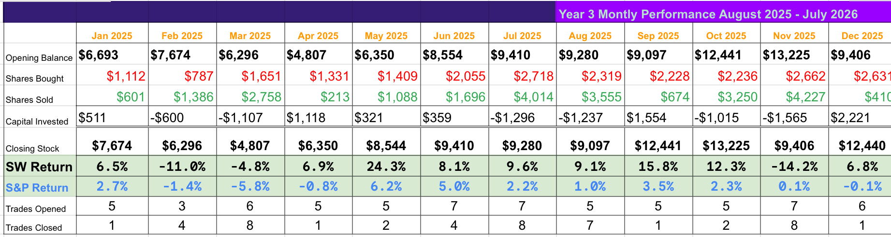

# Note -- January 1, 2026

2025 ended with an 85% roí, a bit below the last couple of years but well ahead of the indices.

---

*Source: [Strategic Wave Trading Notes](https://stephentobin.substack.com)*
