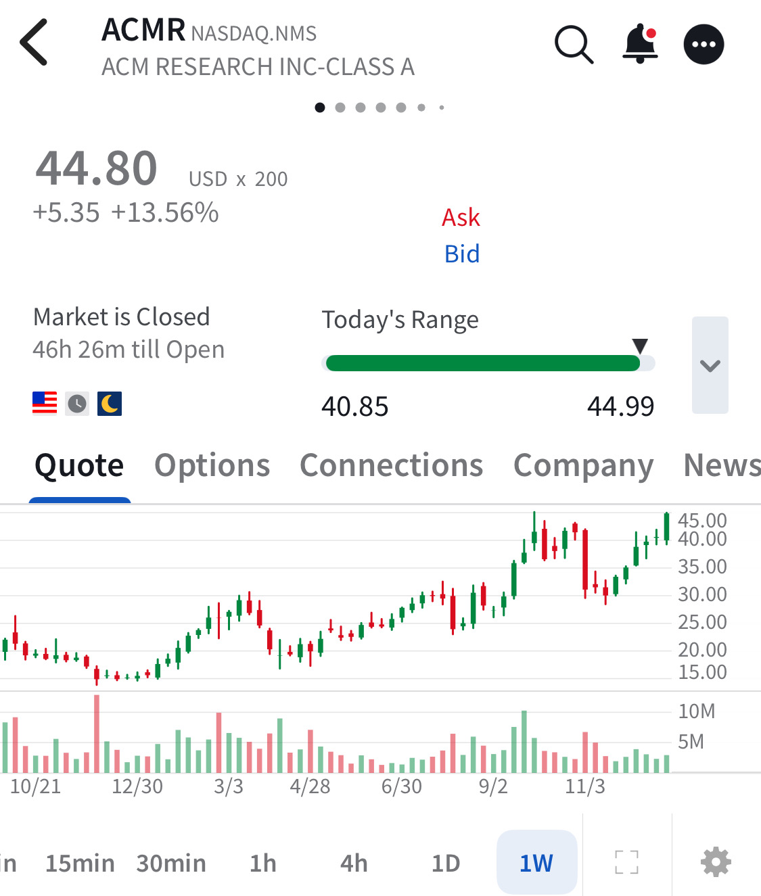

# Note -- January 3, 2026

I had a great start to 2026 with the portfolio of 21 names up 5.8% on day 1. Only one stock in the red and four showed double digit gains $ACMR was the star again up nearly 14% and now pushing against previous resistance. First trade of 2026 due for execution on Monday.

---

*Source: [Strategic Wave Trading Notes](https://stephentobin.substack.com)*
