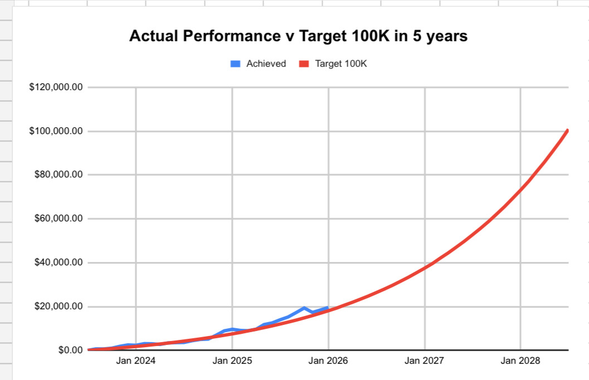

# Note -- January 5, 2026

My portfolio is on fire so far in 2026, up 7.8% in two days. Held of making a trade Today, missed out on  a 5% move due to a bit of over caution. It will be my first Agentic AI investment and I hope it will deliver 100% in 2026. I will be buying tomorrow. Half way in the road from $250 a month to $100k.

---

*Source: [Strategic Wave Trading Notes](https://stephentobin.substack.com)*
