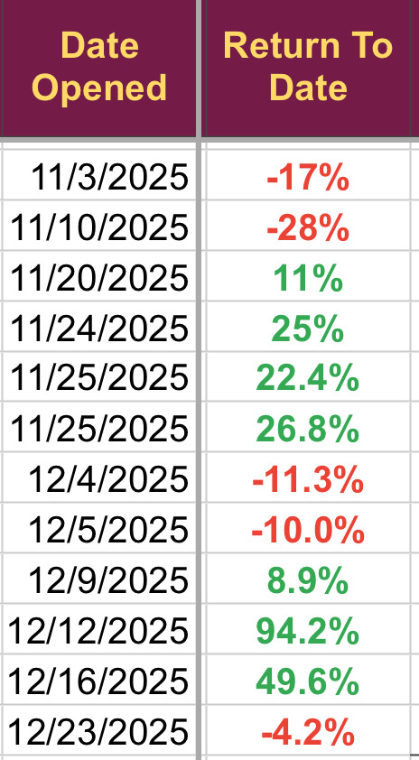

# Note -- January 6, 2026

November was my worst ever month recording a loss of 14% but the trades from that month appear to be turning higher along with those taken in December. First January trade will be taken today and I hope the trend continues, January so far up a crazy 8.8%

---

*Source: [Strategic Wave Trading Notes](https://stephentobin.substack.com)*
