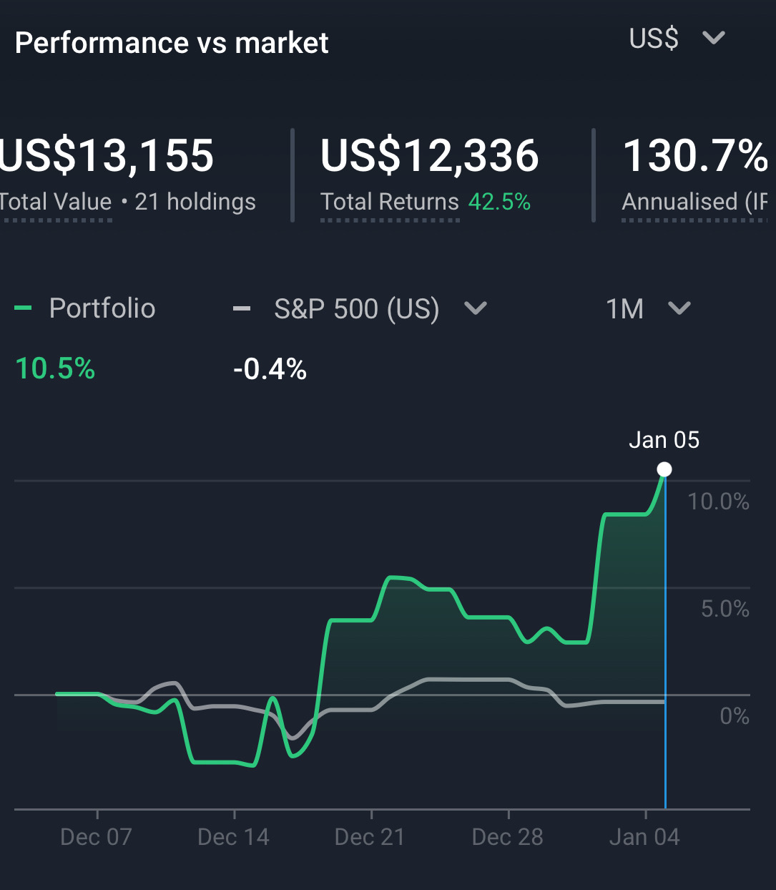

# Note -- January 6, 2026

Annualised return just passed 130% thanks to a 10% gain in the last 30 days. Performance has not been perfect, biggest mistake has been closing some trades too early. $ELVA, $ONDS, $LEU the biggest errors. Will have to put that right in 2026!

---

*Source: [Strategic Wave Trading Notes](https://stephentobin.substack.com)*
