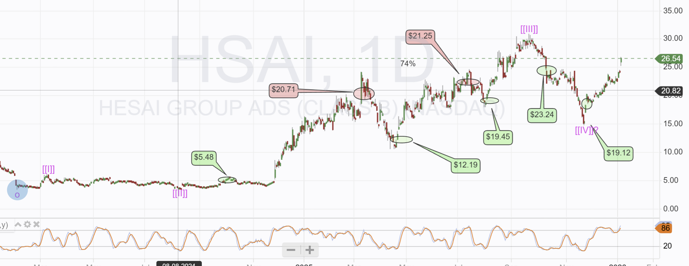

# Note -- January 6, 2026

The portfolio is moving again, now up 10.3% in January. $HSAI is today’s star. It is up 10% and as it is my largest single investment, it has an outsized effect on the portfolio. The chart shows all previous trades, green for open and red for close. Hesai has been a big winner, and the news of a doubling of production is driving today’s pop. The chart gives a technical target of $95 and that would be very nice.

---

*Source: [Strategic Wave Trading Notes](https://stephentobin.substack.com)*
