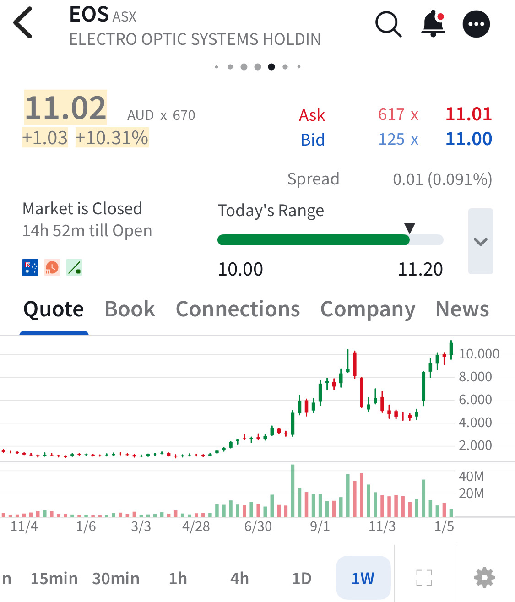

# Note -- January 13, 2026

$EOS, Electro Optic Systems jumped 10% overnight and seems to have broken a previous point of resistance. the trade is up 120% since our investment on December 12 but can it hold above $10? A sustained move here would suggest $20 as a target.Portfolio continues to move higher now up 16% in January.

---

*Source: [Strategic Wave Trading Notes](https://stephentobin.substack.com)*
