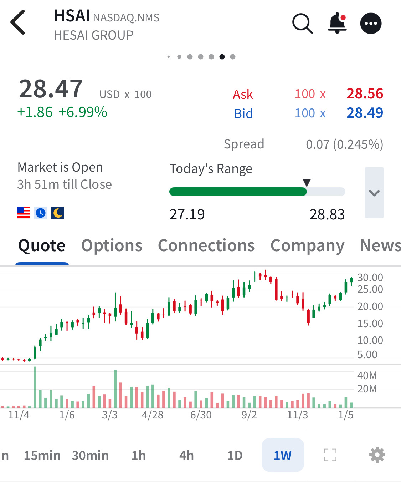

# Note -- January 15, 2026

A mixed trading day, 8 of 22 holdings in the red but with my three biggest investments all up 7% the account is showing a nice profit. The chart shows Hesai, the largest position in my $250 to $100k project account approaching $30 its previous all time high. We have traded Hesai 5 times for an 83% return.

---

*Source: [Strategic Wave Trading Notes](https://stephentobin.substack.com)*
