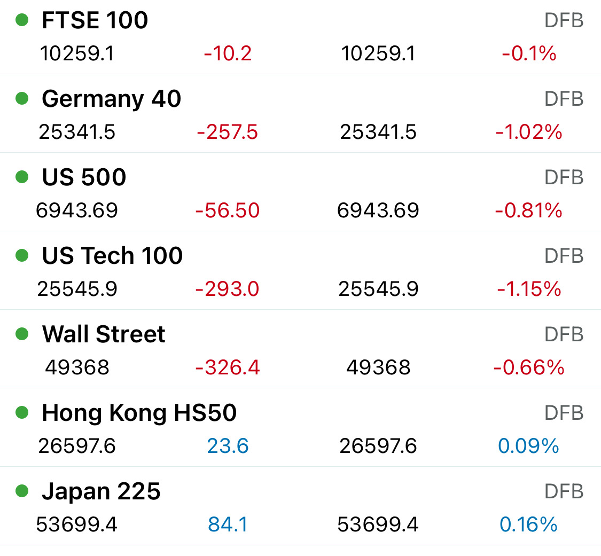

# Note -- January 19, 2026

Still early but futures pointing lower for market open. US Tech set for a rough open, today is a holiday so no way to get out of stocks. Luckily our portfolio has exposure to Australia and China where things seem much better

---

*Source: [Strategic Wave Trading Notes](https://stephentobin.substack.com)*
