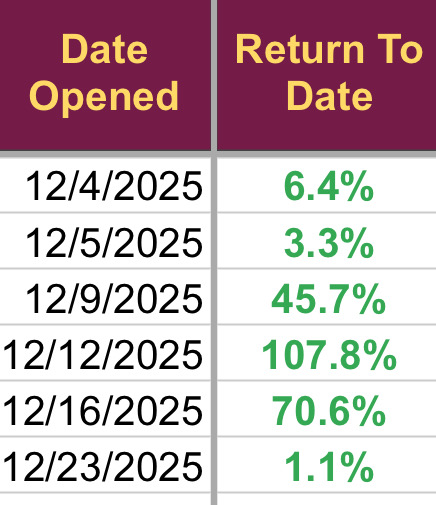

# Note -- January 23, 2026

Down a little today, $MTM jumped 10% and now all 6 trades taken in December are in profit. One good month doesn’t make a fortune, all four trades taken in January are underwater by an average of 4%. Annualised return 134% and that will make a fortune if I can keep it going.

---

*Source: [Strategic Wave Trading Notes](https://stephentobin.substack.com)*
