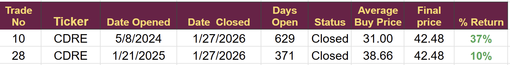

# Note -- January 27, 2026

Closed my position in $CDRE today for a small gain and opened my final trade for January. The portfolio has had a rough couple of days but we are still up 10% in Janaury and well above our longer term targets.

---

*Source: [Strategic Wave Trading Notes](https://stephentobin.substack.com)*
