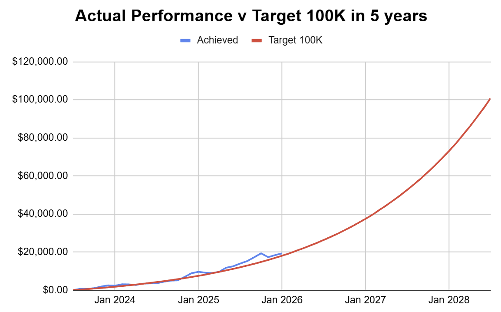

# Note -- January 29, 2026

My portfolio is taking a beating today. Over the week, I am down 6%, hardly catastrophic, but sometimes it feels like it. You have to look at the long term. I have a clear 5-year plan for what I want to achieve, and after 2 and a half years, I am still ahead of target. You have to ignore the short term and keep focused on the longer term, that's how my $250 a month will become $100K, and then investing becomes life-changing.

---

*Source: [Strategic Wave Trading Notes](https://stephentobin.substack.com)*
