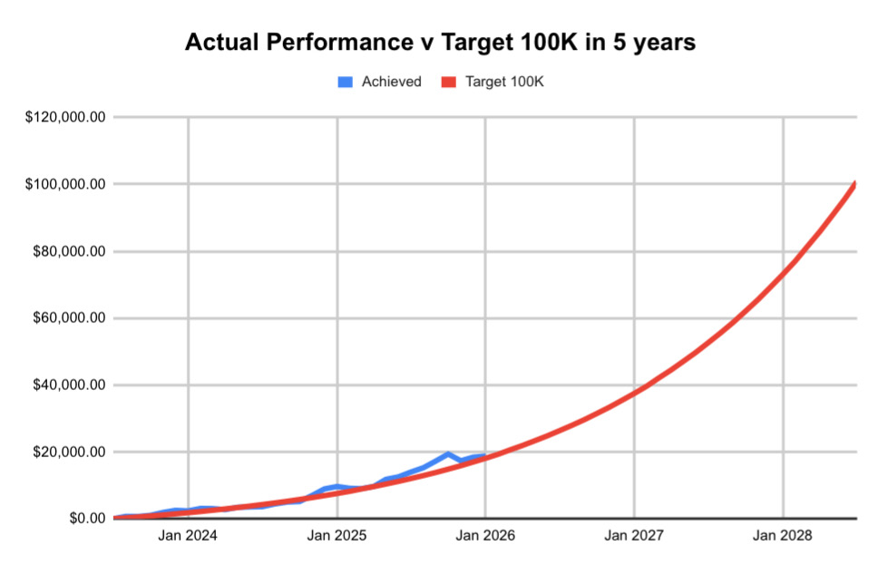

# Note -- January 31, 2026

January scrapped a profit but it means I have met the halfway mark of my five year project. 30 months done, so halfway to turning $250 a month into $100K. Spending a few days analysing every trade and every action to make sure nothing is left to chance

---

*Source: [Strategic Wave Trading Notes](https://stephentobin.substack.com)*
