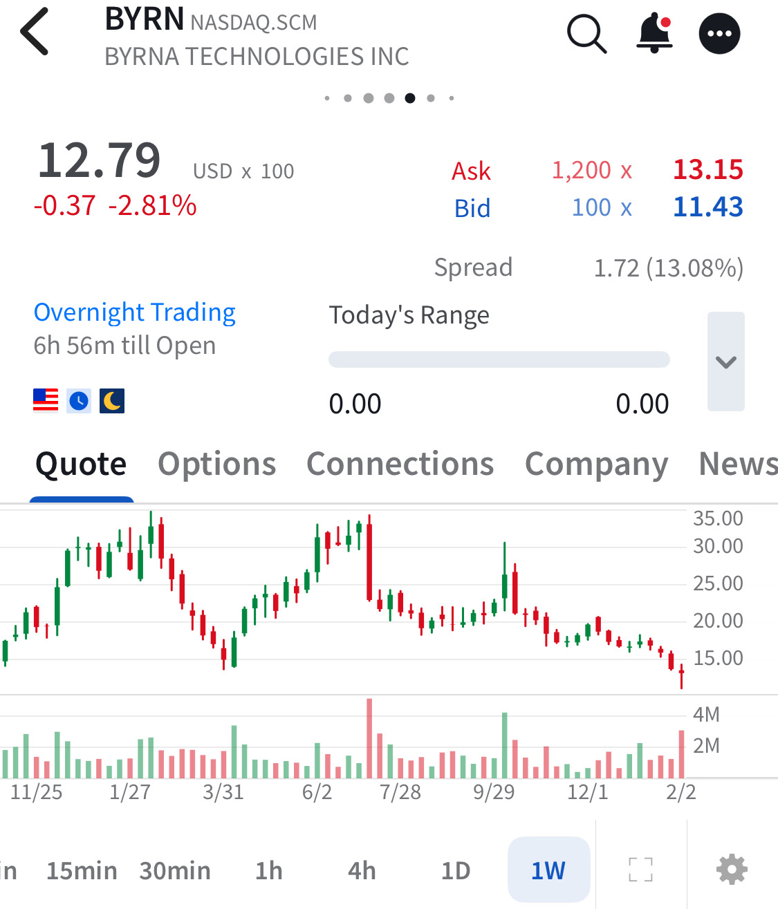

# Note -- February 5, 2026

Traders Who panic pay the market, those with a plan get payed. During yesterday’s market meltdown I added to $BYRN, outstanding earnings report with a forecast of increased margins new products and a doubling of store count. Following the plan, despite heavy drawdown, increasing exposure to high probability multi baggers. Weekly chart below Yesterday’s buy at $11.84 average now $16.39. Target $40 in 2026

---

*Source: [Strategic Wave Trading Notes](https://stephentobin.substack.com)*
