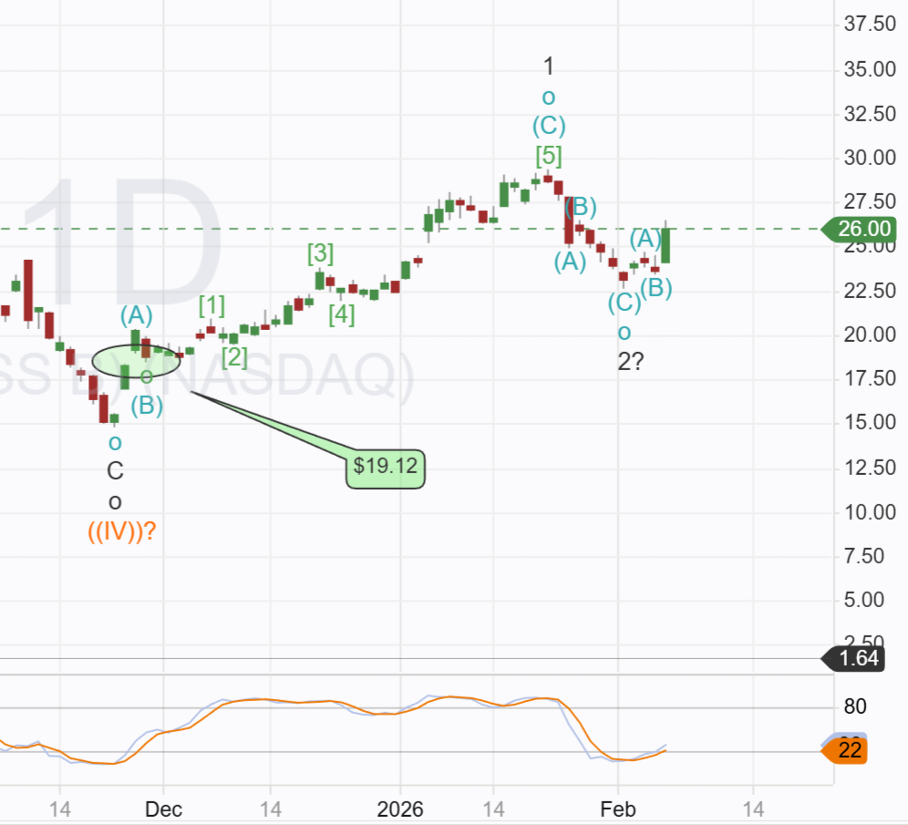

# Note -- February 6, 2026

A solid day to end the week, half of my US stocks up more than 10% erasing much of this weeks drawdown. My pick of the bunch is $HSAI, up 10% and this technical pattern looks pretty solid. Entry point in green, could have found a wave 2 low if so target is above $50.

---

*Source: [Strategic Wave Trading Notes](https://stephentobin.substack.com)*
