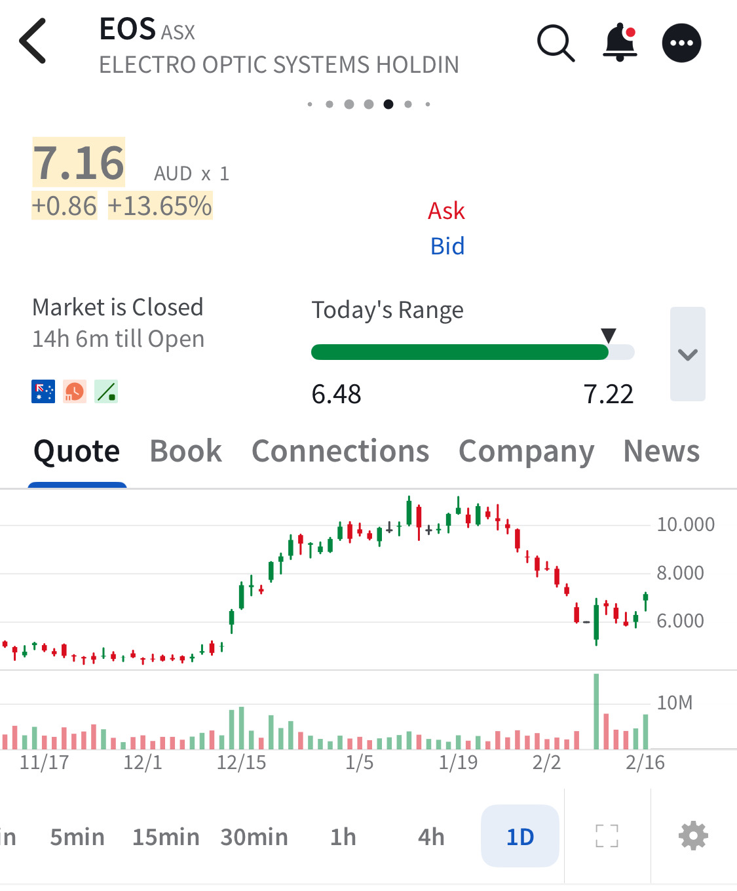

# Note -- February 17, 2026

$EOS, Electro Optic Systems appears to be recovering from the short seller attack. I have two positions average price $5.30, it was clear the short report was nonsense but my trading rules did not allow me to increase my position. Very annoying! Trading is sometimes frustrating but the $250 to $100k project remains on target because of the same rules.

---

*Source: [Strategic Wave Trading Notes](https://stephentobin.substack.com)*
