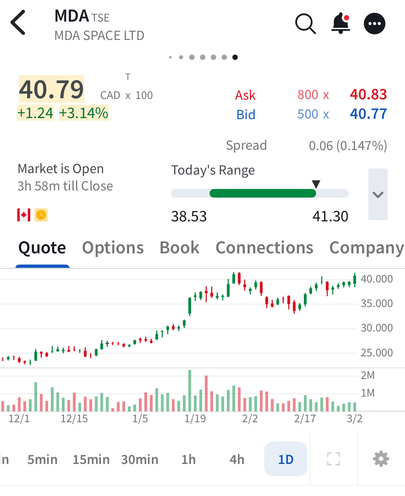

# Note -- March 2, 2026

Small progress today, the portfolio is up 1% with our defence stocks leading the way. $MDA continues to test this $40 resistance, I think it has a good chance of breaking opening up the initial target of $55 and a +100% return.

---

*Source: [Strategic Wave Trading Notes](https://stephentobin.substack.com)*
