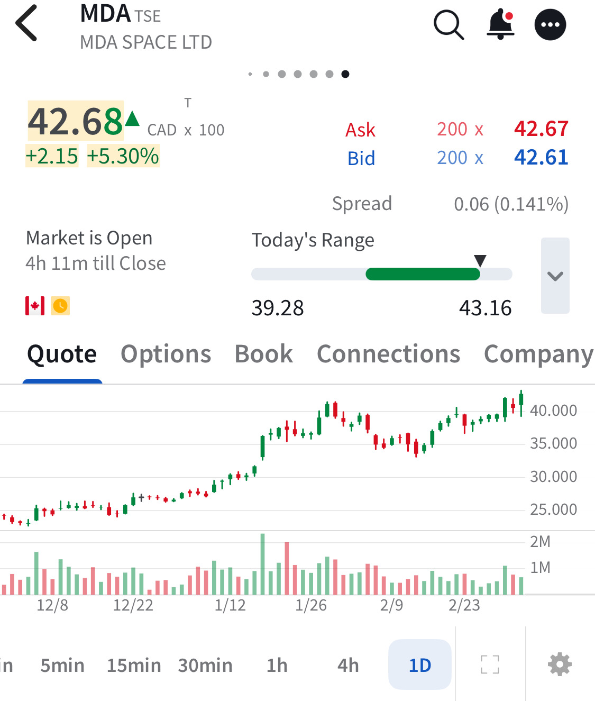

# Note -- March 4, 2026

Good earnings report from $MDA today including 2026 guidance above my forecast. Seems to have pushed the stock passed the $40 resistance line. The position is now up 65% and the 100% target looks reasonable next quarter

---

*Source: [Strategic Wave Trading Notes](https://stephentobin.substack.com)*
