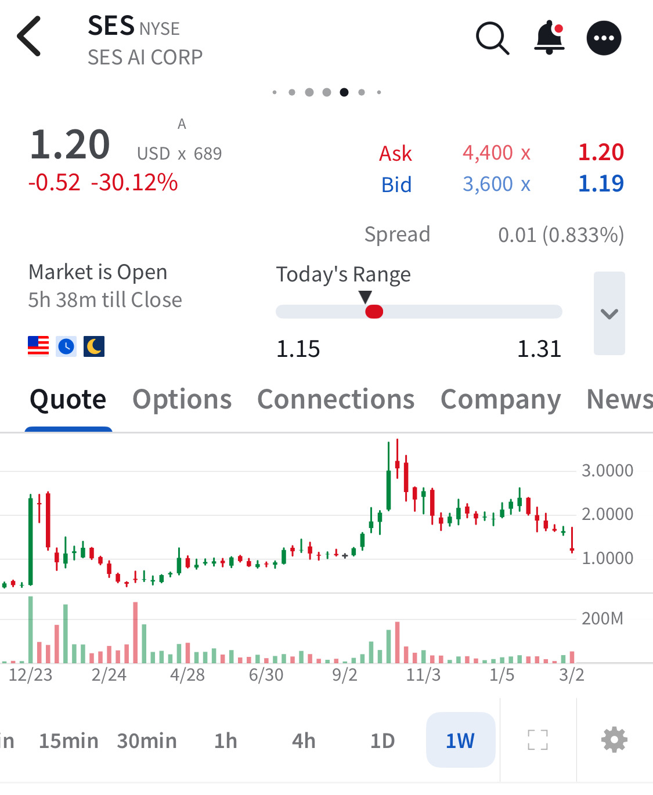

# Note -- March 5, 2026

$SES collapsed after earnings. I had high hopes but am glad I exited in November, overall I made 44% on the company but it was clear its main products were not selling. They used acquired business to pretend they hit revenue guidance but they missed organic revenue targets by nearly 50% and guided to pedestrian growth in 2026.  No battery sales, no drone market, no MU sales and no extension of testing in Auto batteries. A disaster really in every vertical.

---

*Source: [Strategic Wave Trading Notes](https://stephentobin.substack.com)*
