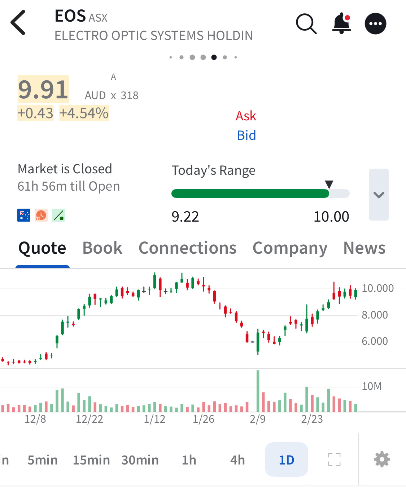

# Note -- March 6, 2026

Electro Optic, making good progress but can it break $10 resistance ?should have added at the recent low but didn’t. I have 2 Position up 87% in total

---

*Source: [Strategic Wave Trading Notes](https://stephentobin.substack.com)*
