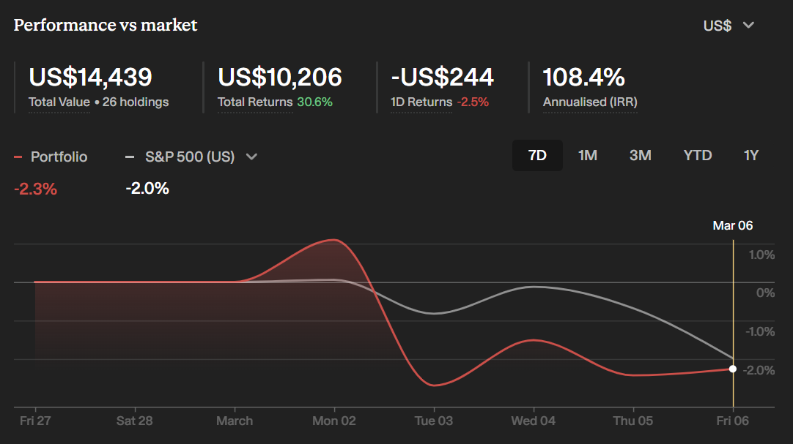

# Note -- March 7, 2026

A down week, but considering the geo-politics, I think my portfolio held up pretty well. I think the beta is over 2, so staying close to the S&P on a down week is a result. Still showing over 100% annualized, but that performance comes with risk, and next week I will enter a new high-risk sector whilst rotating out of an old profitable one. Check out the returns: $10K of the $14K portfolio is from profit!

---

*Source: [Strategic Wave Trading Notes](https://stephentobin.substack.com)*
