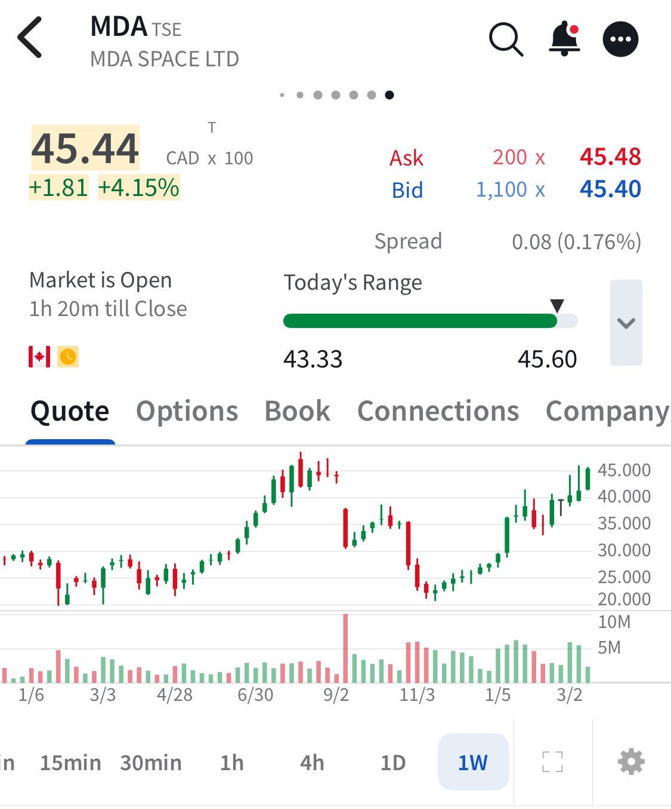

# Note -- March 18, 2026

$MDA pushing up against former resistance and pressuring an all time high. I am not a great market timer but got this one right. Bought the last pull back at $25 which is turning out to be a nice move. It should be said it is one of only a few bright spots in the portfolio with the majority of stocks in the red this month 

---

*Source: [Strategic Wave Trading Notes](https://stephentobin.substack.com)*
