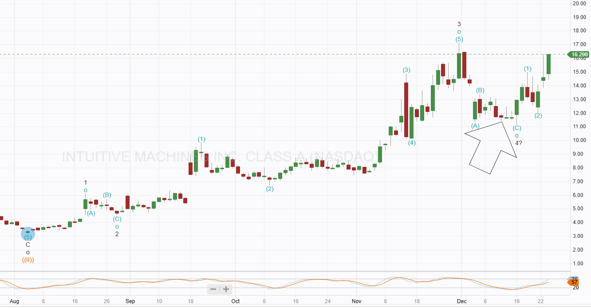

# Note -- December 24, 2024

Intuitive Machines is up 10% today. We added to this position on December 12th, and the stock has risen 30% since then. The original position from April is up 196%.

The chart below shows the pattern I am following. I am not a technical trader, but I use charts to help me identify entry and exit points and ensure I do not buy a top. The arrow shows the day we added. I continue to hold a target of $50 a share, which is my original fair value figure.

 December has been a good month, with the portfolio returning over 20%, following November's 31%. I guess I am due a pullback in January.

I expect a very busy January as I will add to several positions due to the large amount of cash in the account after closing QBTS earlier this month.

---

*Source: [Strategic Wave Trading Notes](https://stephentobin.substack.com)*
