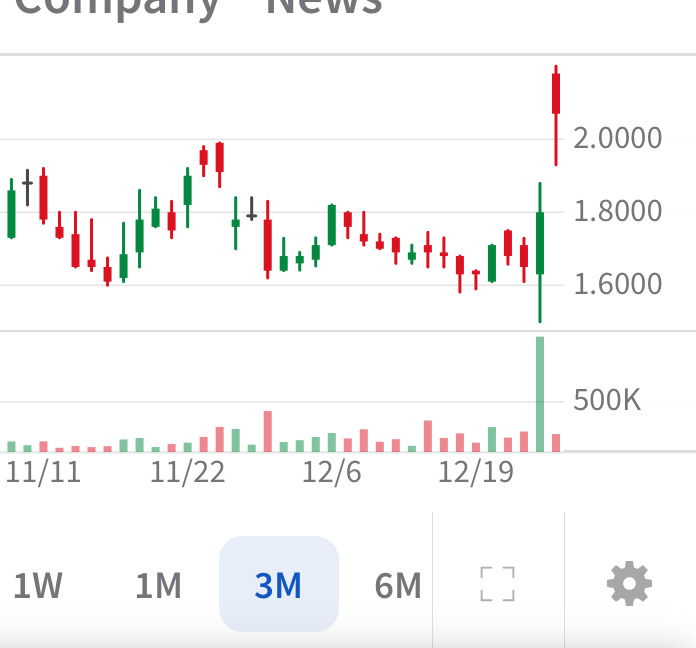

# Note -- December 27, 2024

ARBE is up 15% today, we bought it in June and it has been pretty flat since. I interviewed the CEO of Arbe last week (a link to the interview is in a post) and have been considering adding to the position, todays price action means I will probably wait until after the holiday’s. The portfolio is up 119% in 2024 thanks to big gains in this final quarter.

---

*Source: [Strategic Wave Trading Notes](https://stephentobin.substack.com)*
