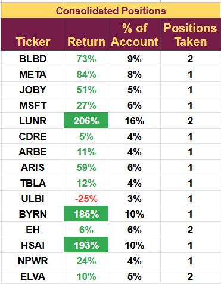

# Note -- January 2, 2025

It looks like a good start to 2025, with every position in the portfolio showing a profit. Hesai (+17%) and LUNR(+13%) are leading the way. LUNR is up without any company-specific news, but HESAI is being driven by the slew of positive sales data from the Chinese EV makers who are Hesai's biggest customers.

The portfolio is up 4.9% on a pretty amazing day. I have just finished the December wrap-up video, which will be posted tomorrow; as usual, it looks at last month's performance and the leading prospects for this one.

Current open positions are:

---

*Source: [Strategic Wave Trading Notes](https://stephentobin.substack.com)*
