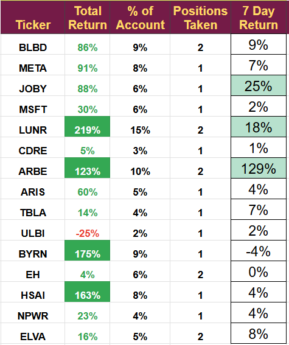

# Note -- January 7, 2025

ARBE jumps again (up another 20%) and takes my demonstration portfolio with it. I started the "Strong Buy" portfolio on August 1st, 2023, investing $250 each month. Eighteen months later, it is worth more than $10K, and today, it has moved above 300% total return. I appreciate all the pledges people are making as they follow and hope that is a recognition of their profits from following.

As promised in my December wrap-up video, I completed a review of Hyliion but did not like what I saw and will not be investing. On another note, one of our companies, Hesai, released some world-first products at the CES show that will strengthen its position as the leading LiDAR manufacturer. As soon as I get a chance, I will add to the Hesai position.

Some other stocks in the portfolio are moving at the moment. JOBY is over $10 for the first time since we invested, and we continue to hold. BYRN is pulling back a little, and we will await the next earnings call before deciding if we should add. LUNR has jumped. It is a risky time, and the next launch is due soon, so we will wait to see what happens. The portfolio is still cash-rich, and I am looking for opportunities to invest but remain patient and conservative. Full holdings in the portfolio in this image.

---

*Source: [Strategic Wave Trading Notes](https://stephentobin.substack.com)*
