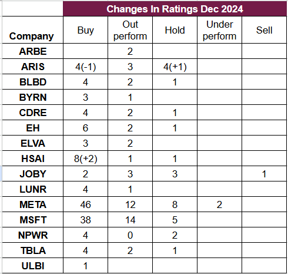

# Note -- January 9, 2025

Updated Wall Street Analyst ratings for all stocks in the portfolio. Very few changes in December. The street is more Bullish on HSAI with two firms opening coverage with a Buy rating, and slightly less Bullish on Aris with one firm moving from a Buy rating to a Hold. It is not a big part of the trading plan but I do keep an eye on sentiment. Aris is down 8% this month and I am reviewing with an eye to adding to the position.

---

*Source: [Strategic Wave Trading Notes](https://stephentobin.substack.com)*
