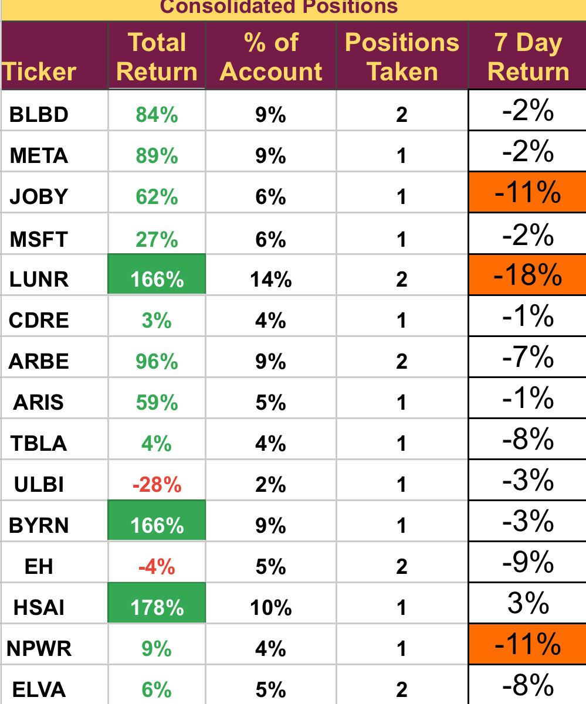

# Note -- January 11, 2025

14 out of 15 stocks in the portfolio were down this week. JOBY, LUNR and NPWR were all down more than 10%. Joby and LUNR were both affected by downgrades from Wall Street. I continue to hold all positions. I am working hard on two new trades in January, both look very promising and will be sent to subscribers as soon as my due diligence is complete.

---

*Source: [Strategic Wave Trading Notes](https://stephentobin.substack.com)*
