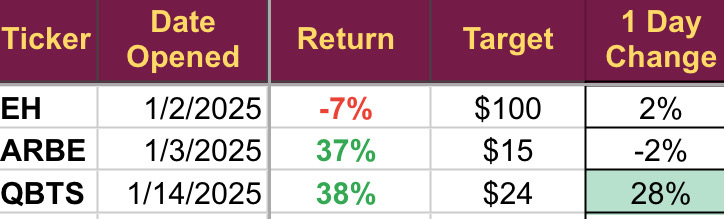

# Note -- January 15, 2025

Yesterday’s trade D-Wave (sent to subscribers yesterday afternoon) has jumped higher already. The NVIDIA quantum day, just announced, may lead to a sustained run higher. The other trades taken so far in 2025’ image below, are looking good and there was positive news from Electrovaya, one of our larger holdings, as they have started hiring for the new US production facility. One more trade still likely this month but I am struggling to get the working capital schedule sorted at the moment so it may be a few more days.

---

*Source: [Strategic Wave Trading Notes](https://stephentobin.substack.com)*
