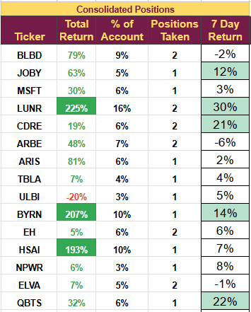

# Note -- January 21, 2025

Several of the stocks we hold have important news today. 

Hesai announced multiple design wins with the Chinese EV maker Chery Automobiles; Chery sold 2.6 million cars in 2024 and will start using Hesai LiDAR from Q4 2025. Hesai has now announced more than 100 design wins from 21 automakers.

Byrna announced the date for the next earnings call (Feb 7th). I expect record results and implied volatility on the stock has surged. Two analysts have increased their earnings forecast, and none have lowered it.

LUNR has completed packing Lonestar's data center onto its moon lander, which is due for launch later this month. Lonestar hopes to be the first to have a fully operational data center on the moon's surface. The center will be used as a backup anchor point for satellites.

We added more Cadre today. January has been a very busy month, with one new trade opened and three positions added. It is the most active month since we started the demonstration portfolio in August 2023.

2025 is off to a great start, with a more than 10% return. A complete list of holdings below.

---

*Source: [Strategic Wave Trading Notes](https://stephentobin.substack.com)*
