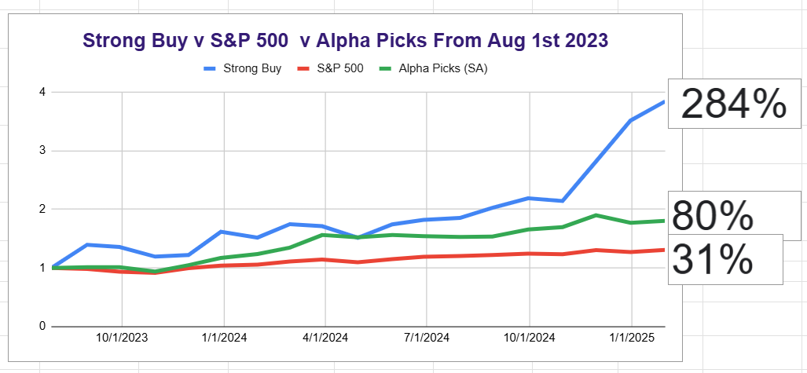

# Note -- January 30, 2025

With one trading day left in January, I have just completed the prospect list for February. We have 1 space stock, 1 graphene stock, 2 AI stocks, and 3 next gen energy stocks on the list. I am currently researching one of the new energy stocks, it is a nuclear Co. and I have got stuck on the demand side of the research. What if the purported growth in data centers does not materialize? The growth is predicated on the US tech companies dominating the AI market and building their data centers on home soil. What if DeepSeek is just the first of a wave of AI from outside the US, and companies decide to build data centers in countries with much cheaper infrastructure costs, like India? Without the growth in data centers, the US will not need new nuclear SMRs; it is a quandary.

I will do a full update over the weekend, but so far, the month is looking good, and the strong-buy portfolio continues to outperform our two benchmarks.

---

*Source: [Strategic Wave Trading Notes](https://stephentobin.substack.com)*
