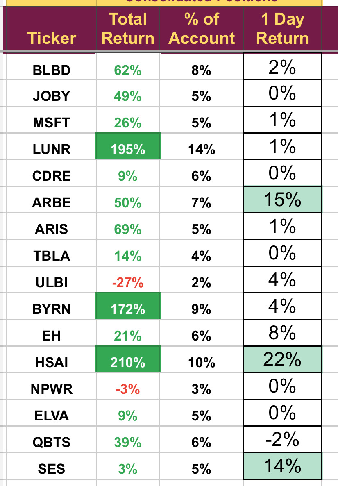

# Note -- February 6, 2025

Volatility continues but today it is working in our favour. Bluebird beat on top and bottom line with earnings but the reaction has been muted. Changes to regulation is putting a big question mark over our investment, currently writing an update that I will send to subscribers outlining the problems with this trade as I see it. Full list of holdings in the portfolio below, no changes so far this month.

---

*Source: [Strategic Wave Trading Notes](https://stephentobin.substack.com)*
