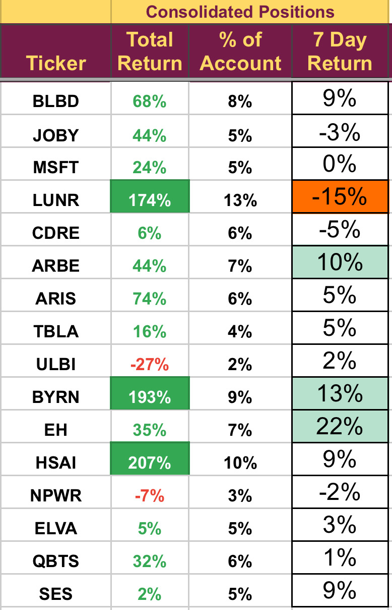

# Note -- February 8, 2025

Earnings season is underway and so far so good. Both BYRN and BLBD beat on top and bottom lines. I am meeting with the CEO of BYRN next week to discuss some of the changes they have made to the business model and will update subscribers. LUNR was down after a Wall Street analyst moved to a bearish stance. The next launch is only a couple of weeks away so we will hold. The portfolio has now eked out a 1% profit for February, full list of holdings below 

---

*Source: [Strategic Wave Trading Notes](https://stephentobin.substack.com)*
