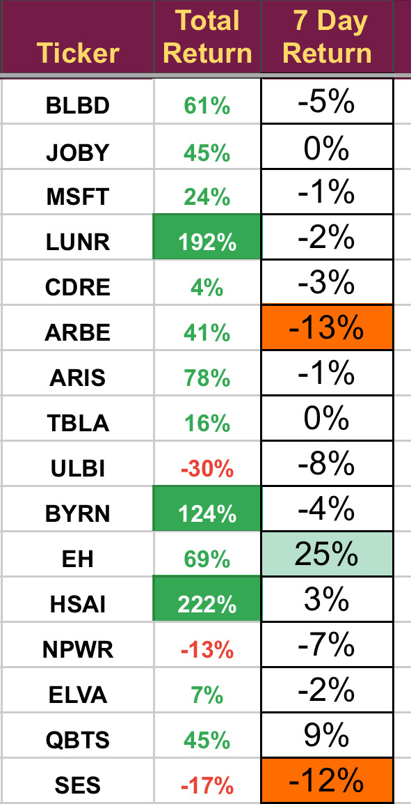

# Note -- February 15, 2025

A mixed week but we are now up 4.2% in February so it is getting better. A couple of stocks on the chopping block for next week, NPWR looks as if it is sailing against the wind at the moment, still concerned about BLBD and we need to see good earnings from ULBI or they could also be cut. One more space stock looking promising for next week but still in the research stage.

---

*Source: [Strategic Wave Trading Notes](https://stephentobin.substack.com)*
