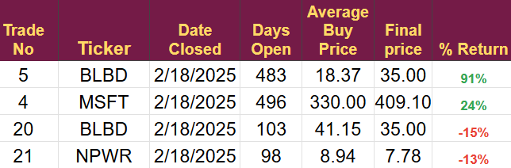

# Note -- February 18, 2025

Deciding to cut an investment when you still believe in the company is difficult. Today, I had to cut two of my favorite long-term bets, BlueBird and NetPower; they are great companies with excellent products and quality management teams. I have made a lot of money in the past investing in companies run by the Rice brothers and I thought NetPower would be another big win. It’s strange how we get attached to these companies and support them like a sports team. But they are not sports teams. They are companies, and the only point of investing in companies is to build wealth.

We have to remember it’s all about the money and things change. NetPower and BlueBird are dependent on the US continuing to move to a clean energy future and that doesn't look very certain at the moment. 

Sometimes, a bit of ruthlessness goes a long way.

The closed trades from today are below, the important thing is we took the losses early and now have cash in the account to invest elsewhere, if I had just let it run there may have been very little cash to re-invest

https://stephentobin.substack.com/p/trade-alert-exiting-npwr-blbd-and?r=nh85d&utm_campaign=post&utm_medium=web&showWelcomeOnShare=false

---

*Source: [Strategic Wave Trading Notes](https://stephentobin.substack.com)*
