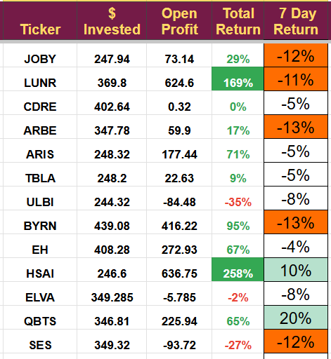

# Note -- February 22, 2025

Enormous volatility continues. It was clear this was likely at the beginning of the year, and I have been taking action to limit the effect. We now hold 30% of the portfolio in cash, having exited three positions this week. The result still isn’t great, but it means the portfolio value is only down 1.2% in February, which is a very pleasing performance considering the fact we trade small caps emerging stocks.

I have three companies that I am very close to buying at the moment. They will hopefully diversify us a little and reduce some of the volatility; two in Europe and one of three companies in the US will. They give us geographic diversity.  Again, they are all small caps,

I am also trying to re-position the portfolio a little as it is heavily exposed to new energy stocks, which might be in for a more difficult time. Two of the new companies are heavily exposed to the European military and security sectors, and the third is a graphene new materials company.

Although we have lost a bit of money, I am grateful we were not exposed to any big losses this week. The one-week performance is shown below, and there is a lot of red! And fewer holdings

---

*Source: [Strategic Wave Trading Notes](https://stephentobin.substack.com)*
