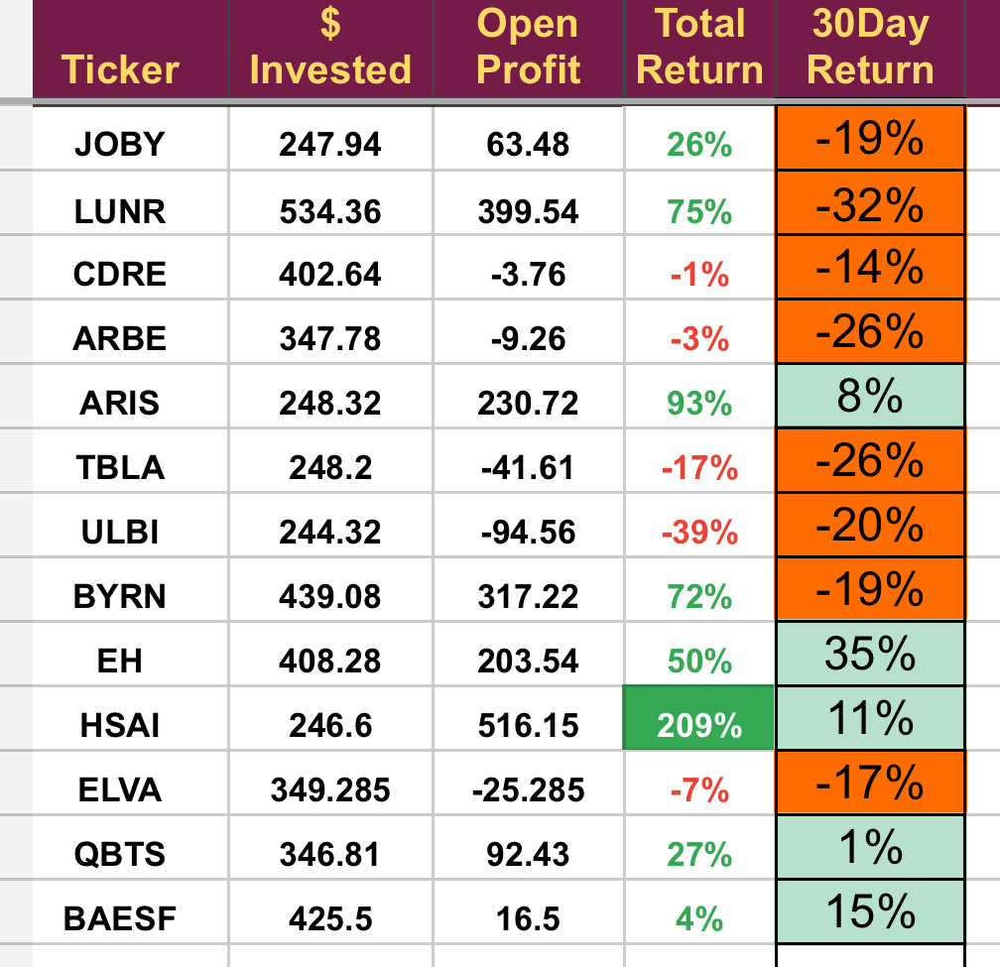

# Note -- February 28, 2025

It is important to reflect on your performance regularly and make a conscious effort to improve. The markets are constantly changing and you must adapt what you are doing to suit. History teaches us that losers learn nothing from history. February looks like being my worst trading month in 2 years, down 13%. Of course we mustn’t over react. We had three huge months prior to this one that returned more than 75%. And we are still up 250% in the last 2 years but things are changing, the markets are sending some clear messages and we should all listen. The ESG trade is withering, trade barriers are going up and armed conflict seems to ever more likely.

The portfolio is cash heavy as we made the decision in January to take a more defensive stance. 

I will be looking to use the extra cash to pick up some bargains in the coming months as some stocks have been hit much harder than they should and I will continue to look for opportunities in European Defense following this months investment in BAE Systems. Oil and Gas looks attractive again and our only oil stock ARIS water is doing well, I will look to add to that sector in the coming months.

I have a few positions on the chopping block, awaiting for earnings ARBE, ELVA, ULBI and JOBY don’t fit into the new defensive structure and are all closely linked to batteries and EVs. They might have to go to make better use of the cash invested in them. 

---

*Source: [Strategic Wave Trading Notes](https://stephentobin.substack.com)*
