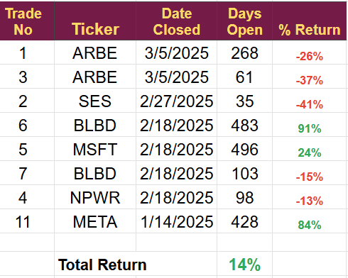

# Note -- March 5, 2025

I continue to adjust the portfolio in light of the changes in the US administrations changing priorities. In the first three months of 2025 I have closed more positions than in the whole of 2024 or 2023. 

I am moving out of clean energy, EVs and US government supported stocks but continue to invest in emerging technology small caps stocks.

Trades closed in 2025 are in this graphic, the only consolation is they delivered a small profit. 

We still have 12 open positions and will be looking to add this month as we have a lot of cash on the account, in fact more than 30% of the value is now in cash. I am not one for holding and waiting for the turn around, I will continue to follow the money and make it work for me.

---

*Source: [Strategic Wave Trading Notes](https://stephentobin.substack.com)*
