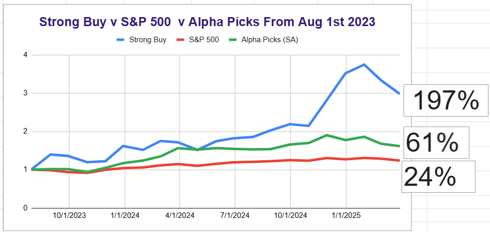

# Note -- March 7, 2025

Just exited most of my position in Intuitive Machines. If the portfolio doesnt gain soon February and March will be the first times since 2022 I have suffered two consecutive months with double digit losses (February -11%, March -10.6% to date). The last time I had three consecturive months was 2020 and the only time I had four was 2008. The Portfolio as a whole remains well above benchmark performance but is suffering quite a setback.

---

*Source: [Strategic Wave Trading Notes](https://stephentobin.substack.com)*
