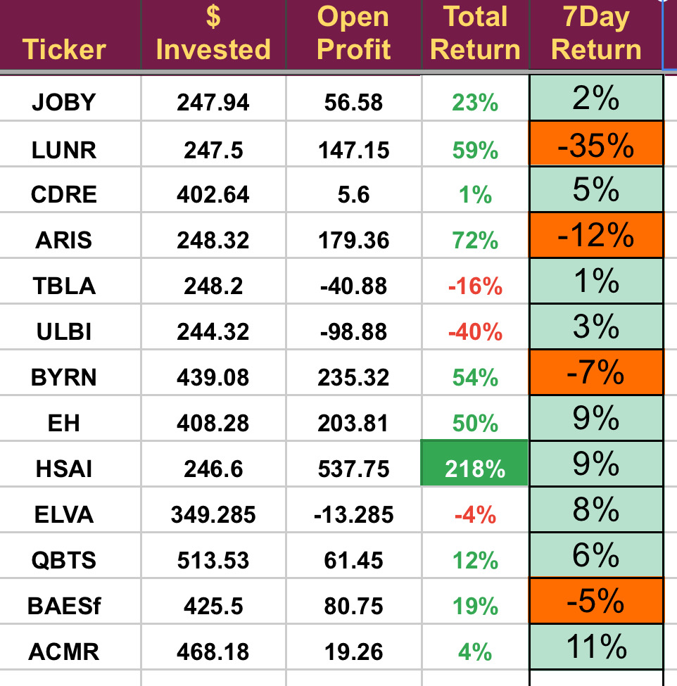
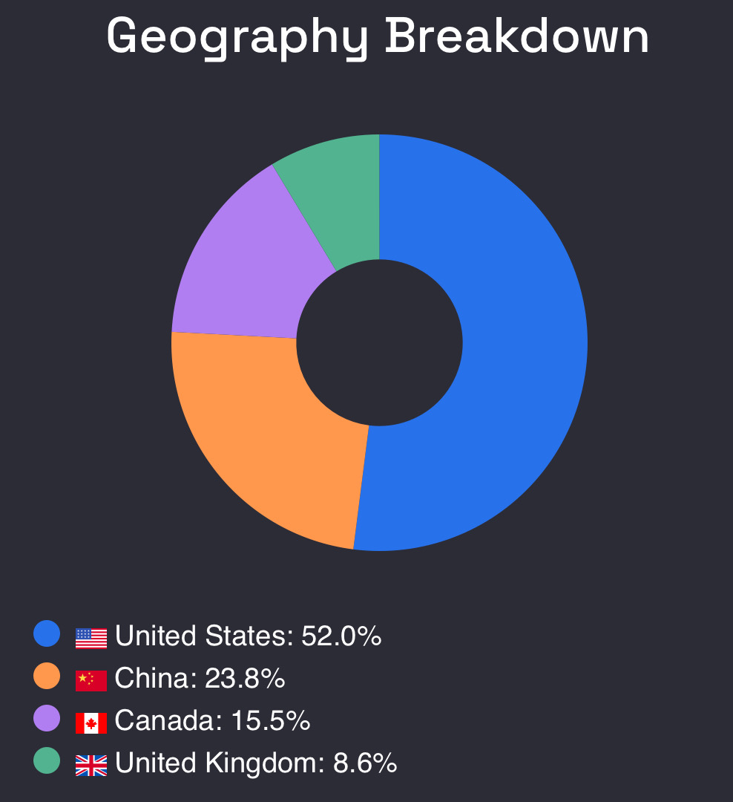

# Note -- March 9, 2025

Apart from the collapse in LUNR, that was a pretty good trading week. Unfortunately LUNR was my largest position so it did have a big negative impact, I have held on to the original position but sold the other two for substantial losses. Aris water announced a dividend today, I am going to review them in detail this week, they have been a good trade. 

The rotation out of new energy and US stocks is going well with US stocks now only 50% of the portfolio. I thought I had found a good investment in Avon Technologies but it is one of those stocks where after I have completed all of the research something is bugging me but I can’t work out what!

---

*Source: [Strategic Wave Trading Notes](https://stephentobin.substack.com)*
