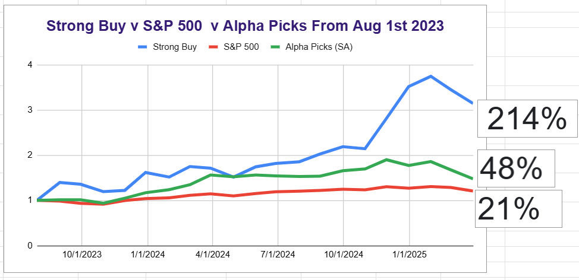
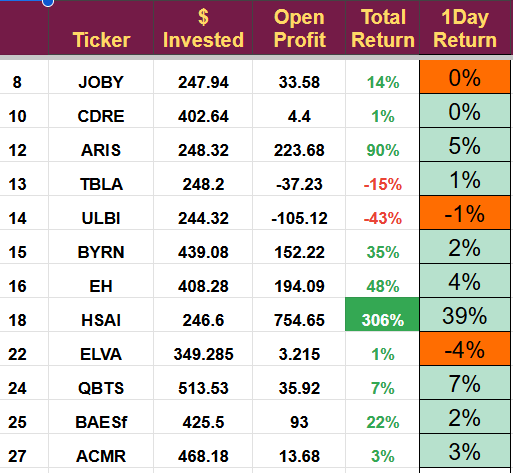

# Note -- March 11, 2025

Hesai, our Chinese LiDAR stock, jumps nearly 40% on news of its deal with Mercedes and its excellent earnings report. We bought Hesai in October 2024 and it has returned nearly 300%. I have not had a chance to add to the position, which is a shame, but will take an opportunity that arrives. It also vindicates the decision to drop Arbe when they did not announce winning the European OEM contract in January, I had said several times I thought it was Mercedes. Arbe is down over 60% in the last 30 days and fro $1.36 to $1.18 since I got exited.

The strategic decision to pivot out of new energy stocks means we missed the big drop in NPWR as we exited in February for a loss of 18%, it has fallen another 61% since then. Intuitive Machines is the only blot on the portfolio where I took a big hit, should have got out when it was up 200%, not for a loss.

I had a good meeting with Electrovaya's CEO this morning and will write a detailed report. Their situation is particularly relevant as they are a Canadian company that exports products to the US. I also have a meeting with the management of Aris water soon and I will be writing that up next week. Both ELVA and Aris look like excellent prospects, and I may be looking to add to them if an opportunity arrives.

The recent moves to close trades and hold cash means we only have 12 positions, and today, they are doing pretty well despite the continuing drop in the markets.

The portfolio has slowed its fall and remains well above benchmarks. AlphaPicks from SeekingAlpha seems to be having an unusually poor time, perhaps a reflection of the way it buys companies at the top of their cycle, a problem with all quant-based strategies.

I have several high-conviction investment proposals at the moment, but I am waiting for some calm in the markets before buying. Preserving capital is essential when we have this level of volatility. Please subscribe to read about the new investments as the timing improves.

---

*Source: [Strategic Wave Trading Notes](https://stephentobin.substack.com)*
