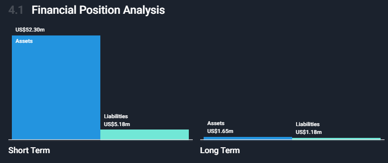
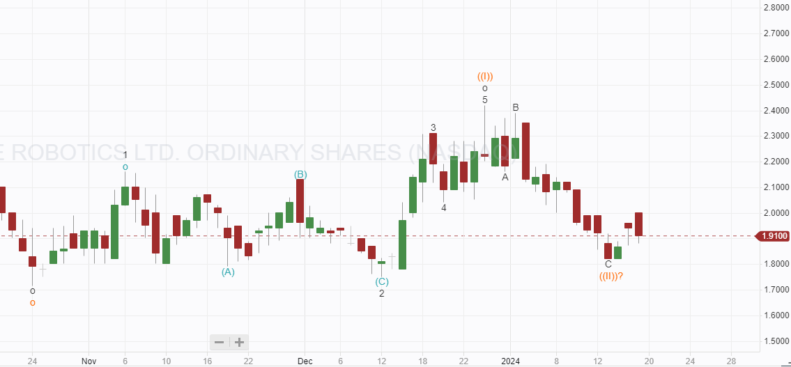
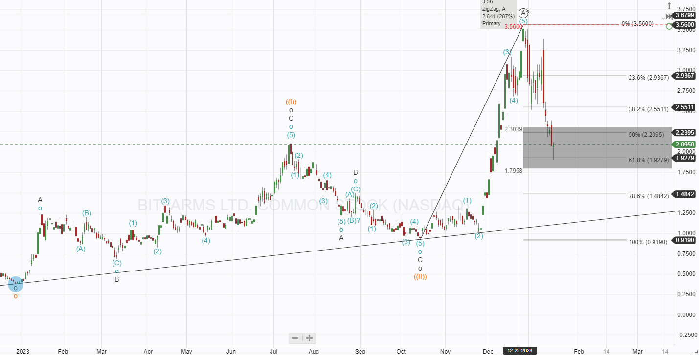
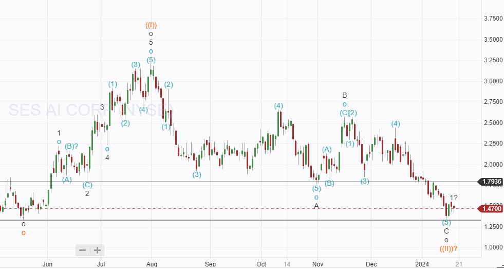

# 3 Trades on the Buy List for this week

*ARBE, SES and BITF ready to trigger trades*

Three stocks have moved to my buy list for this week ARBE, BITF, and SES. ARBE and SES have strong fundamentals with near-term catalysts that should drive prices higher in the medium term. BITF is different it is a Bitcoin miner and so super risky, I have done really well out of BITF so far but will take a half-size position if I decide to trade because of the risk involved.

# Buying ARBE

I have written about ARBE a few times, and so far, I have lost money with them. They still have a superior product; they manufacture 4D Radar systems that compete with LIDAR, and the Radar provides data to autonomous perception systems. Being Radar, it has a long range, is more accurate, and can see through many things. it can deliver information like "there is a dog behind that bush" and "A child is riding a bike behind those parked cars," or "that paper bag on the road is full of nails". 

Adopting their system would help improve the safety of all autonomous machines.

At the recent CES 2024, ARBE showed real commercial progress, one of its OEM customers, Sensrad is a part of Qamcom (a kind of business incubator for tech companies). Sensrad uses the Arbe chipset to develop a complete radar system. At CES [they announced](https://ir.arberobotics.com/news/press-releases/detail/115/arbe-celebrates-milestone-achievements-as-sensrad-announces) 4 significant order developments that would validate Arbes technology commercially.

Arbe announced [the release](https://ir.arberobotics.com/news/press-releases/detail/114/arbe-announces-the-availability-of-production-intent) of its mass production intent chipset for the automotive industry. This is a big deal, a single order from a major auto OEM would transform the potential for ARBE. These events will likely lead to an outperformance of Arbe, relative to market perception, in the coming quarters and a rise in stock price.

The ARBE balance sheet remains rock solid with zero debt. Image care of (Simplywall.st)

Negative cash flow has been decreasing as Arbe has moved toward production, and if it continues to do so at the same rate, it have enough cash for three years. Shareholders suffered 20% dilution last year, and that must be factored into any investment; more dilution is a possibility as the cost base may change as they move to a new phase of the company. ARBE do not manufacture the chipset, manufacturing is performed by GlobaFoundries.

On a technical note, Arbe may have reached a bottom in November last year, the drop counts in 5 waves providing some evidence that it may have run its course. Since then, a move higher looks like it is evolving in a motive way; if the wave ((II)) holds, it would suggest a strong move higher is near. I will Buy as long as wave ((II)) holds, targeting a 100% return.

**Bitfarms**

Bitfarms has returned to an area where I could consider buying again. The fundamentals are unchanged, but it is closely tied to the value of Bitcoin so we can expect extreme volatility. I have bought BITF twice in the last 12 months, making a 100% return on each investment.  I will review it before buying, but at the moment, it looks quite promising; Friday’s candle looked like it might signal a turnaround in the area expected.

# **SES AI**

I wrote about [SES on the Seeking Alpha](https://seekingalpha.com/article/4663644-ses-ai-leading-the-charge) platform recently, they look like having a great year and may potentially announce major news in the coming months as two more auto OEMs move to B sample of their 100 Ah battery cell. They are shaping up to be the technological leaders of the next generation of battery technology. 

I am looking for a suitable time to buy this company, as always, trying to decide if a bottom is in. There is some good evidence in the case of SES, but that bottom needs to hold for me to buy. Price action on Friday looked very promising, and as long as nothing major happens today, I will buy with a stop at $1.25.

---

*Source: [Strategic Wave Trading](https://stephentobin.substack.com/p/4-trades-on-the-buy-list-for-this)*
