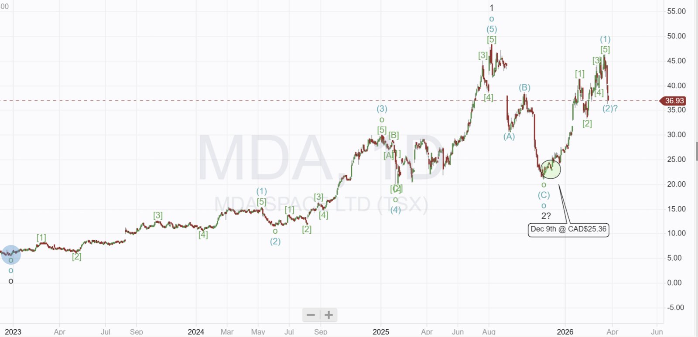

# A Note on MDA Space

*MDA are caught in the middle of speculation and rivalry with Amazon, Tesla and Apple fighting it out*

I have an open position in MDA Space shown on this chart (I have TSX: MDA, not the recently issued US share, so prices are in CAD$)

A sharp pullback has occurred in the last few days, coinciding with a broader market pullback and a drawdown in my portfolio. MDA shares have fallen from CAD$46.11 to CAD$36.93, a 20% decline over 6 trading days.

The chart above suggests a low might be registered soon and gives a 2026 price target of $100. I am not a technical trader and use the chart to make me aware of potential turning points. Only the fundamentals of the business can make me trade.

However, the chart makes me ask: **What is going on with MDA?**

## Cancelled Orders

MDA Space has recently increased its defence business but remains reliant on its satellite systems division for some 70% of its revenue and almost all of its profits. The company’s software-defined satellite is a potential market leader, and it is one of the few companies to have developed a scaled satellite third-party manufacturing facility capable of producing 2 satellites per day, with a target of 400 per year.

MDA's satellite business has seen large orders signed but has also been hit by equally large cancellations.

In September 2025, MDA signed a CAD$1.8 billion contract with Echostar with options to double the contract. A few weeks later, Echostar was acquired by SpaceX, which promptly canceled the order. MDA stock fell 20% in a single day, leading to the December low I bought.

A feeling of déjà vu has gripped the market, as the same scenario may play out again.

MDA signed a CAD$1.1 billion order with Globalstar to manufacture 50 satellites to provide direct-to-device connectivity to Apple iPhones. MDA's beam-forming technology is crucial to this award and means iPhones do not need a line of sight to the sky (they can be indoors) to connect to the satellite constellation. The satellites are due for launch in mid 2026, with the complete constellation expected to be in orbit by early 2027. MDA has said 50% of the work is now complete.

## SpaceX to Buy GlobalStar?

Earlier this month, speculation renewed that SpaceX will acquire Globalstar and once again cancel an MDA contract. This is really a fight over spectrum rights, and any deal to acquire GlobalStar will be complicated. The price is estimated at $10 billion, and there are three potential buyers. SpaceX, Amazon, and Apple.

## SpaceX

Rumours started in late 2025, but recent FCC documents suggest the relationship between the two is not going well. SpaceX has repeatedly asked the FCC to allow it to share the Globalstar spectrum, a move Globalstar is resisting. On March 24th, SpaceX filed a petition asking the FCC to dismiss Globalstar's application for a new, higher-power mobile satellite system, claiming that Globalstar is trying to monopolize spectrum access and wants the FCC to freeze applications until new sharing rules are decided. Globalstar has filed to block SpaceX from using its spectrum or sharing any of its satellites.

In January, SpaceX filed a million-satellite orbital data constellation application with the FCC, possibly in the hope of forcing the FCC to allow it to piggyback on adjacent GlobalStar satellites.

The two companies are fighting like bitter enemies; it could be a ploy by SpaceX to drive down the price, or perhaps that GlobalStar is looking elsewhere, and SpaceX is trying to make GlobalStar look less attractive to the competition.

## Amazon

Amazon, with its project Kuiper, hopes to become a SpaceX competitor, and Globalstar's spectrum would give it a quick route to direct device connectivity. SpaceX already has a direct-to-device in the testing phase, and Amazon is behind.

Amazon is now mass-producing its own satellites; it is vertically integrated, using its own chips and technology, but it lacks the bandwidth.

Amazon also has a rocket bottleneck; it was meant to launch 1,600 satellites by July but has asked the FCC for a 24-month extension. If Amazon cancelled the MDA/Globalstar order, it would likely make the delays even more substantial, probably taking 2-3 years for Amazon to redesign the Globalstar constellation to fit Amazon's in-house manufacturing. MDA is flight-ready, and those flights are booked.

Amazon would probably need the MDA satellites, and I think it would almost certainly continue with the contract since 50% of the work is complete and MDA has cancellation clauses built into it.

SpaceX had to pay MDA when it canceled the Echostar contract, but the sum was smaller because the contract was less advanced.

## Apple

This is the canary in the coal mine for both SpaceX and Amazon. Apple has invested more than US$1.5 billion into the GlobalStar/MDA constellation.

Apple paid US$400 million in late 2024 for a 20% stake in GlobalStar SPE (Special Purpose Equity). The SPE owns the satellites and licences for the network MDA is building. It means GlobalStar manages the operations, but Apple owns 20% of the hardware.

Apple also has the option to force GlobalStar to buy back 20%, which could be a massive payout for any third party.

Apple has a US$1.1 billion investment being used to fund the launch of the MDA-built satellites and the construction of the ground stations needed to run the constellation. The money is paid quarterly on meeting milestones (apart from an initial $250 million used to pay down high-interest debt). This is structured as a loan, and Apple could issue an immediate repayment notice if the contract does not go ahead.

Under the terms, GlobalStar must allocate 85% of the entire network to Apple, effectively locking out its competitors and leaving 15% for GlobalStar to run its legacy IoT businesses. Amazon would get that 15% and may be able to work out a way to share some of the other 85% with Apple.

In my view, the structure of the deal, with Apple owning 20% of the hardware and having an 85% lockout on capacity, may make Globalstar almost impossible to be acquired by anyone else. New buyers would be forced to run Apple’s satellite network or stump up significant damages to both Apple and MDA, making the deal difficult to justify financially.

If Amazon or SpaceX buys GlobalStar, they will either become a partner with Apple or have to pay them and MDA significant damages if they decide to cancel the contract.

Apple plans to launch multiple satellite-enabled features later this year with iOS 20, designed to run on MDA's unique beam-forming technology. Any penalty fees could dwarf the $10 billion acquisition cost.

## My Conclusion

The relationship with SpaceX seems to have deteriorated, and after spending US$17 billion on Echostar, I don't think they will spend another $10 billion on Globalstar, and even if they did, would they want to pay the cancellation charges to MDA as well as what must be pretty significant damages to Apple?

Amazon could be the purchaser, but they would most likely to continue the MDA contract and become a partner with Apple.

The other possibility is that Apple buys the remaining 80% of the company, which would strengthen its supply chain and give it greater control over its operations. For MDA investors, this would be the best outcome: the satellites would be built, and MDA would become a key partner to Apple with significant added potential for further collaboration.

As of this morning, no 8-K or special announcements regarding any takeover have been filed with the SEC, but a number of Form 4 and Form 44 insider-dealing notices have been registered; generally, these appear to be pre-planned and not related to current speculation.

The FCA confirmed this month that GlobalStars' ground stations in Canada and South Korea will reach operational readiness; these are Apple-funded, and increasing damages will result if the contract is canceled.

**Disclaimer:** I am not a financial advisor and do not provide investment advice. **This newsletter details my personal high-risk trading in small-cap emerging stocks**. Past performance, which includes large gains along with periods of drawdown doesn’t guarantee future returns. Make independent investment decisions based on your own research and risk tolerance; you are solely responsible for outcomes.

Paid Only

This is not a trade alert, but is preparing the way for a possible addition to MDA I will be monitoring SEC filings and press releases over the weekend and early next week, but if nothing comes, I will take the opportunity to increase my exposure to MDA and will, of course, send a Trade Alert if I decide to do so.

---

*Source: [Strategic Wave Trading](https://stephentobin.substack.com/p/a-note-on-mda-space)*
